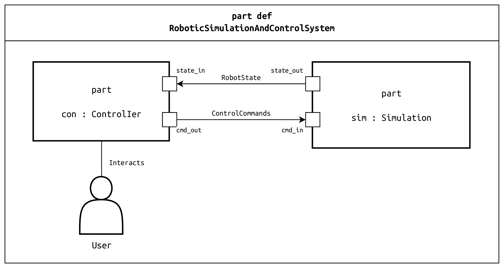

**Software engineering project for the 25-26 course**

This is a README file for the SE25 project's GitHub repository. This README is designed to be the central entry point for any team member, providing all the necessary information to get started, understand the project's goals, and contribute effectively.

---

# SE25 – Robot Simulation and Control System


This repository contains the source code and documentation for the **SE25 - Robot Simulation and Control System**, a project for the Project-Based Learning (PBL) course in Software Engineering.

The project involves the development of a real-time robotic simulation and control system, adhering to the ISO 12207 software life cycle processes and utilizing terminology from the IEEE Guide to the Software Engineering Body of Knowledge (SWEBOK).

## Core Technologies

- **Language:** C++ (using C++17 standard)
- **Middleware:** ROS 2 Jazzy Jalisco
- **RT & Concurrency:** POSIX (pthreads)
- **Build System:** CMake
- **Operating System:** Ubuntu 24.04 LTS
- **Version Control & PM:** Git & GitHub

## System of Interest (SoI) Overview

The System of Interest is a distributed system composed of two primary components: a **Simulation System** and a **Control Interface**. These components communicate in real-time to simulate a 6-axis robotic arm in a 3D environment and allow for its control through a user interface.

### System Architecture

The following SysML v2 diagram illustrates the high-level structure and the primary data flows of the system:



### Key Operational Scenarios

The system is designed to fulfill the following core operational scenarios:

1.  **System Initialization and Robot Loading:** The user launches the system, which loads a 3D model of a robotic arm into a virtual world and establishes a connection between the simulation and the control interface.
2.  **Manual Control:** The user manually controls the individual joints of the robotic arm in real-time via the control interface.
3.  **Automated Path Execution:** The user defines a sequence of target poses, and the system calculates and executes a smooth trajectory for the robot to follow.
4.  **Fault Detection and Response:** The system detects a collision in the simulation, immediately halts the robot's motion, and notifies the user.

## Project Structure

This repository is structured as a ROS 2 workspace. All custom packages are located within the `src` directory.

```
/se25_robot_control
├── src/
│   ├── simulation_pkg/      # ROS 2 package for the simulation environment
│   └── control_pkg/         # ROS 2 package for the control interface and GUI
├── docs/
│   ├── SRS.md               # System Requirements Specification
│   ├── ADD.md               # Architectural Design Document
│   └── images/              # Contains diagrams for documentation
└── README.md                # This file
```

## Development Environment Setup

To ensure a consistent development environment for all team members, please follow these setup instructions carefully on **Ubuntu 24.04 LTS**.

### 1. Install Core Dependencies

First, install Git, GCC compiler, and CMake.

```bash
sudo apt update
sudo apt install git build-essential cmake
```

### 2. Install ROS 2 Jazzy Jalisco

Follow the official ROS 2 documentation to install the **ROS 2 Jazzy Jalisco** `ros-desktop` version.

[Official ROS 2 Jazzy Installation Guide](https://docs.ros.org/en/jazzy/Installation.html)

The key installation command is:

```bash
sudo apt install ros-jazzy-desktop
```

After installation, remember to source the setup file in your shell:

```bash
echo "source /opt/ros/jazzy/setup.bash" >> ~/.bashrc
source ~/.bashrc
```

### 3. Clone and Build the Project

1.  **Create a Colcon Workspace:**
    ```bash
    mkdir -p ~/ros2_ws/src
    cd ~/ros2_ws/
    ```

2.  **Clone the Repository:**
    Clone this repository into your workspace's `src` directory.
    ```bash
    git clone https://github.com/your-username/se25-robot-control.git src/se25_robot_control
    ```

3.  **Install Dependencies and Build:**
    Use `rosdep` to install any package dependencies and `colcon` to build the workspace.
    ```bash
    rosdep install -i --from-path src --rosdistro jazzy -y
    colcon build
    ```

4.  **Source the Workspace:**
    Finally, source your local workspace's setup file. Add this to your `.bashrc` for convenience.
    ```bash
    echo "source ~/ros2_ws/install/setup.bash" >> ~/.bashrc
    source ~/.bashrc
    ```

## Usage

After successfully building the project, you can launch the full system using the provided ROS 2 launch file.

1.  Open a new terminal.
2.  Source your workspace: `source ~/ros2_ws/install/setup.bash`
3.  Launch the system:
    ```bash
    ros2 launch control_pkg full_system_launch.py
    ```

## Project Management

This project is managed using **GitHub Issues** and **GitHub Projects**. This keeps our tasks, discussions, and code all in one place.

-   **[Issues Tab](https://github.com/MII-IS/SE25/issues):** All requirements, tasks, bugs, and feature requests are tracked as issues.
-   **[Project Board](https://github.com/orgs/MII-IS/projects/1):** A Kanban-style board is used to visualize the workflow and track the status of each issue. The columns are: `Backlog`, `To Do`, `In Progress`, `In Review`, `Done`.

## Contribution Workflow

All code contributions must be made through **Pull Requests (PRs)** to ensure code quality and maintain a stable `develop` branch.

1.  **Create/Assign an Issue:** Before starting work, make sure there is an issue that describes the task. Assign it to yourself.
2.  **Create a Feature Branch:** Create a new branch from the `develop` branch. Name it according to the feature or issue (e.g., `feature/REQ-FUN-006-path-execution`).
3.  **Implement and Test:** Write your code and include necessary unit tests. Ensure all tests pass locally.
4.  **Submit a Pull Request:** Push your branch to GitHub and open a pull request to merge it into the `develop` branch. Link the PR to the issue it resolves.
5.  **Request a Review:** Assign at least one other team member to review your code. Discuss any feedback and make necessary changes.
6.  **Merge:** Once the PR is approved and all checks have passed, it can be merged into `develop`.

## License

This project is licensed under the MIT License. See the `LICENSE` file for details.

## Team Members

| Role | Name | GitHub Handle |
| :--- | :--- | :--- |
| Project Manager | Ricardo Sanz | @rsanz |
| System Architect | Ricardo Sanz | @rsanz |
| Lead Simulation Engineer | Javier Pulido | @Pulido1822 |
| Lead Control Engineer | Pablo Fraile | @PabloFraile |
| Tooling Lead | Adela Zapatera | @adelazapatera |
| QA Lead | Daniel D'Alascio | @danieldalascio |
| Integration Lead | Victor Rodríguez | @Victor23RR |
| Documentation Manager | Elisa Oyaregui | @elisa109 |
| Configuration Manager | [Student Name] | [@github-username] |

---
